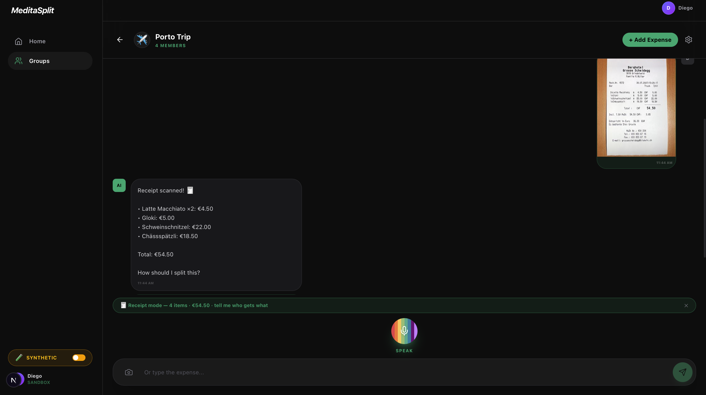

# MeditaSplit

> **Splitting a bill shouldn't take longer than eating it.**
> From photo to payment in 10 seconds — no spreadsheets, no WhatsApp threads, no chasing.

🏆 Built at the **bunq Hackathon** by Giorgio Maria, Francesco, Vaggelis & Diego.


---


---

## The problem we kept living

Six people. One restaurant. One bill of €240. Someone pays. What follows is the universal modern tax:

- 4 to 7 WhatsApp messages over 3 days
- A Splitwise entry that someone forgets to settle
- A €3.50 rounding fight that ruins Tuesday
- A Revolut/PayPal/IBAN ping-pong that never quite closes

This is the **single most common social money friction for bunq's core users** — millennials and Gen Z who travel together, eat out, share Airbnbs, and split everything. It happens hundreds of times in a user's life. And yet the state of the art is: type it into a tracker, then *manually* go and send the requests.

We thought we could do better with one photo and one sentence.

---

## How we're different

The space is crowded — but nobody actually *closes the loop*.

|                                  | Splitwise | bunq Slice    | **MeditaSplit**                |
|----------------------------------|:---------:|:-------------:|:------------------------------:|
| Tracks who owes what             | ✅        | ✅            | ✅                             |
| Reads receipts automatically     | ❌        | ❌            | ✅  *Claude Vision*            |
| Voice input ("split last night's drinks with Diego") | ❌ | ❌ | ✅ *Speech + agent*        |
| Finds the actual transaction in your bank | ❌ | ❌            | ✅ *agentic search over Bunq*  |
| Sends real payment requests      | ❌        | ✅ *manual*   | ✅ *automatic, one tap*        |
| Natural-language follow-ups      | ❌        | ❌            | ✅ *"remove him", "same as last time"* |

**Splitwise tracks. Slice splits manually. We *execute* — from photo to push notification, hands-off.**

That's the entire pitch.

---

## What it does — three input modes, one outcome

📷 **Receipt photo** — Claude Vision parses every line item and price into structured JSON. The agent maps natural-language descriptions onto receipt items: *"pasta"* → `Spaghetti Carbonara`, *"birre"* → `Birra Moretti ×3`. Quantity math is handled (5 Americano @ €10 means €2/unit, distributed correctly).

🎤 **Voice** — say *"split last night's sushi with Diego"* and the agent searches your real Bunq transaction history, finds the €42 charge, resolves "Diego" against your group, and proposes the split. Three words in, payment out.

⌨️ **Text / conversation** — *"add Vaggelis"*, *"remove Francesco, he paid separately"*, *"same split as last time"*. The agent keeps the last 4 exchanges in context, so corrections feel like talking to a person, not editing a form.

🧾 **Manual entry** — for structured splits (e.g., a known total you want to divide yourself), the Add Expense modal lets you enter amounts per-person without going through the AI path.

Every confirmed split fires real `request-inquiry` calls via the Bunq API. Recipients get a push notification. They tap. Done.

---

## Why this belongs inside bunq

Three reasons we built this on Bunq specifically — and why it would slot into the app as a native feature:

1. **Bunq users already split.** Slice exists *because* it's the dominant use case. We're an automation layer on top of behaviour bunq already has.
2. **Bunq has the data nobody else does.** The agent can *find* the bar tab from yesterday because it's already in your transactions. No competitor — not Splitwise, not Tricount — has this. It's a moat that only a bank can offer.
3. **Bunq users are the AI-native demographic.** They're the ones who *want* to talk to their bank instead of tapping through 4 screens.

This is a feature that makes Slice 10× faster, not a competitor to it.

---

## How the agent actually works

We built a real agentic loop, not a wrapped prompt. Up to **8 reasoning turns**, two carefully scoped tools, and hard guardrails at every decision point.

```
User input (text / voice / photo)
        │
        ▼
   Receipt? ──yes──▶  SPLIT_PROMPT_WITH_RECEIPT
        │              (direct item assignment, no tools needed —
        │               receipt JSON is authoritative)
        no
        │
        ▼
   splitAgentSystemPrompt + tool-use loop (Claude Sonnet 4.6)
        │
        ├─ match_contact(name) ─────▶  Fuse.js fuzzy match → confidence score
        │       < 0.60 → STOP, return question + member buttons
        │
        └─ search_payments(query, days) ─▶  Bunq transaction search
                0 results → STOP, return error + "enter manually" button
                1 result  → use it
                multiple  → best match + alternatives as tappable suggestions
        │
        ▼
   { total, description, splits[], suggestions[] }
        │
        ▼
   Split preview with one-tap "Confirm"
        │
        ▼
   /api/bunq/split-group  →  one request-inquiry per recipient
        │
        ▼
   ✅ Recipients receive Bunq push notification
```

### Two design decisions worth highlighting

**Receipt fast lane.** When a photo is uploaded, we *bypass the agentic loop entirely*. The receipt JSON is authoritative — we don't need search, we need assignment. This cuts latency from ~6s to ~1.5s and saves tokens on the most common path.

**Suggestion buttons instead of error messages.** Every dead-end the agent hits returns *clickable next-step options*, not text walls. Unknown contact? Buttons for every group member. Multiple matching transactions? Each one as a tappable card. This is what makes it feel like an app, not a chatbot.

---

## Guardrails (because money)

Real payments mean real failure modes. We built explicit blocks for each one we hit:

- **Contact resolution blocks everything.** If a named person can't be matched (confidence < 0.60), the agent stops *before* touching payments or search. No confident-sounding wrong answers.
- **No amount = no fabricated splits.** When the agent finds nothing, it offers "enter manually" — never invents a number.
- **Outgoing-only search.** Top-ups and incoming transfers are filtered out so they can never appear as split candidates.
- **Double-confirm prevention.** Split state is cleared atomically before the Bunq call; a second click is a no-op.
- **Self-payment guard.** If all recipients resolve to the current user, we error instead of sending a zero-recipient request.
- **Non-receipt image rejection.** If Vision returns zero items or a zero total, the upload is refused with a clear message.

---

## Tech stack

| Layer            | Choice                                                          |
|------------------|-----------------------------------------------------------------|
| Framework        | Next.js 16 (App Router)                                         |
| Language         | TypeScript 5                                                    |
| AI               | Claude Sonnet 4.6 via Anthropic SDK                             |
| Banking          | Bunq Sandbox API (full RSA + installation + session lifecycle)  |
| Fuzzy matching   | Fuse.js 7                                                       |
| Voice            | Web Speech API (en-US)                                          |
| Vision           | Claude Vision (multimodal)                                      |
| Styling          | Tailwind CSS 4                                                  |
| Sync             | Server-side JSON store + 3s polling                             |
| Persistence      | `localStorage` for per-group history, JSON store for groups     |

---

## Project structure

```
app/
  api/
    bunq/        Balance · transactions · request-inquiry · split-group · accept
    split/       Agentic tool-use loop (Claude + search_payments + match_contact)
    receipt/     Claude Vision receipt parsing
    groups/      Group CRUD + per-group chat store
components/
  app/           Root state and routing
  dashboard/     Balance card, recent activity, incoming requests
  groups/        GroupsGrid + GroupChat (AI chat + confirm preview)
  payments/      QuickPayModal
  layout/        Sidebar, TopBar
lib/
  bunq/          Bunq API client (signing, session, payment search, alias resolution)
  claude/        System prompts and tool definitions
types/           Shared TypeScript interfaces
scripts/         bunq-setup.mjs · bunq-switch.mjs · test-agent.ts
```

---

## Demo scenarios

1. **Receipt scan, equal split** — photograph a restaurant bill, tap *"Split equally"*, confirm. Under 10 seconds end-to-end.
2. **Voice + transaction search** — say *"split last night's drinks with Diego"*. Agent finds the Bunq transaction, proposes the split, you confirm.
3. **Conversational edit** — after a split is proposed: *"add Vaggelis"* or *"remove Francesco, he paid separately"*. Agent redistributes without restarting.
4. **Complex receipt** — scan a multi-item bill, describe by voice who ordered what. Quantity math and partial-item assignment handled.
5. **Trip overview** — open a group to see total spent across all expenses, with every split tracked.

---

## Live vs. synthetic data

The sidebar has a **🧪 Synthetic / 🔌 Live Bunq** toggle. Switch it to *Synthetic* at any time to run the full UI — including agent splits, group management, and transaction search — against mock data, with no Bunq sandbox required. Useful for demos or offline development.

---

## Try it locally

**Prerequisites:** Node.js 20+, a Bunq sandbox API key, an Anthropic API key.

```bash
git clone <repo>
cd bunq-hackathon
npm install
```

Create `.env.local`:

```env
BUNQ_API_KEY=your_bunq_sandbox_key
APP_CLAUDE_KEY=your_anthropic_api_key
ANTHROPIC_API_KEY=your_anthropic_api_key
```

```bash
npm run dev
```

Open [http://localhost:3000](http://localhost:3000). On first load, two seed groups are created automatically.

To run without a Bunq sandbox, flip the **🧪 Synthetic** toggle in the sidebar — no env changes needed.

---

## The team

Built in (less than) 24 hours by:

- **Giorgio Maria** — agent design, prompts, integration
- **Francesco** — Bunq API client, session lifecycle, payments
- **Vaggelis** — split route, tool definitions, agent loop
- **Diego** — receipt parsing, Vision pipeline, prompts

---

*MeditaSplit — because splitting the bill shouldn't take longer than eating.*